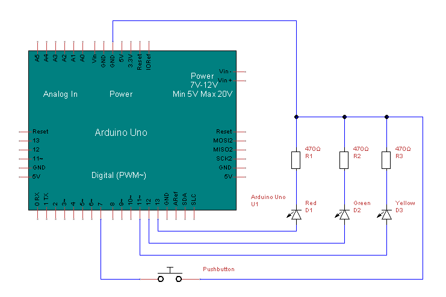

An Arduino sketch for a Morse code USB keyboard, targeting Uno 4.

A user can connect the Arduino to a device via USB and use the pushbutton to tap out a Morse code message. The green LED indicates the device is ready to recieve input. The yellow LED indicates the device is current taking a message. The red LED indicates the device is writing keypresses through USB.
The user has a limited amount of time to enter each message before the device will start writing, however this timing can be adjusted (see below).

The sketch was developed with PlatformIO. Building with PlatoformIO will allow dependancies to automatically be downloaded.

To run, the arduino should be wired as shown:


Morse code does not have a standard for a time unit, but rather varies based on the speed of the user. Therefore, this keyboard makes an estimation of the length of the time unit for each message sent.
The parameters of `readSignalToMSIncrements` can be adjusted to change the length of the message or resultion of the message for fast Morse code users.

```
- Increase the possible length of a message by increasing the SIGNALBITVECTORSIZE.
- Increase the resolution of the data (for fast Morse code users) by reducing incrementLengthInMS. This will reduce the message length unless SIGNALBITVECTORSIZE is increased.
```